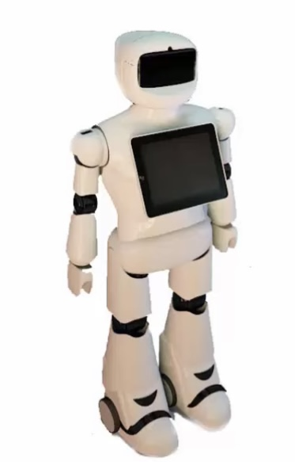

# Intellectual Property and Patent-Items 

This task of the Smart Methods summer training is all about how to register an intellectual property. Most - if not all- of the works and ideas done by Smart Methods are never done by any other, specially in Saudi Arabia, which makes them eligable for registering their ideas as a patent or intellectual property. 

So for registering an intellectual property, which any body can do that if they fulfill the conditions, should follow some steps. 

1 - Register at the Saudi Authority for Intellectual Property at: https://www.saip.gov.sa/ 

They will give you four templates to fill, which are: 

- Abstract about the invention. 
- Full Description. 
- Protection items. 
- Graphics of the invention (if any).

So here I have written the steps for the robot we are creating this summer :point_down: 

### Abstract & Full Description: 
Nowdays robotics are considered important and substantial in the industrial field all over the world and in our country Saudi Arabia for sure. For that, Smart Methods company is creating service robotic that will reduce the cost and increase the productivity. The robot consist of head, structure, and an interactive board. It is equipped with signal reception transistor. These signals will be send through the head, are, and the rest of the robot structure. 

### A Picture of the Invention: 

### Full Description and Protection Items: 
It is a robot that greats audience, and dances Al-muzmar while holding a sword weighs upto 7-13 kg. Adding to that, the robot has a smart screen with a length of 9.4 inches.

Protection Items: 
- The wrist of the robot is able to hold upto 10 kilograms so it can hold the sword to dance smoothly. 
- The motorbox is connected to the hings so it can move it directly. 
- The robot's hand grip can hold the sword strictly to handle it with stability.
- The robot is programmed to clap when it hears the audience clapping. 
- The music is stored in the rabot's memory, so that it dances when it hears the music, and the saudi flag shows on the screen. 
