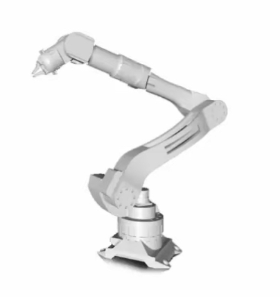

# Patent-Items 

Abstract & Full Description: 
Nowdays robotics are considered important and substantial in the industrial field all over the world and in our country Saudi Arabia for sure. For that, smart methods company are creating service robotic that will reduce the cost and increase the productivity. The robot consist of head, structure, and an interactive board. It is equipped with signal reception transistor. These signals will be send through the head, are, and the rest of the robot structure. 

Explanation of Pictures: 

